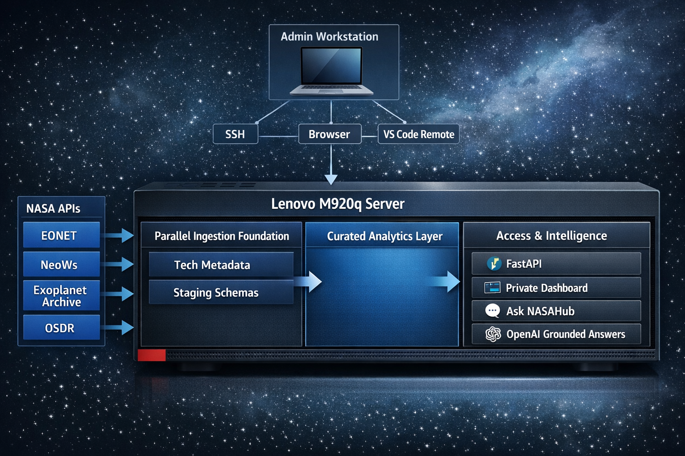
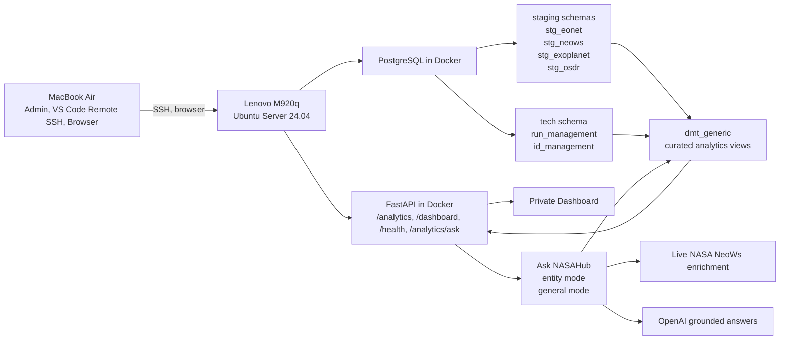

# NASAHub

Self-hosted NASA data platform running on the **Lenovo M920q**.

NASAHub ingests raw source data into PostgreSQL, curates analytics-ready views, exposes them through FastAPI, and now includes a private dashboard for admin use from the MacBook.

Source APIs and datasets currently in scope include:

* EONET
* NeoWs
* Exoplanet Archive
* OSDR

## Goal

NASAHub is being built as a private, self-hosted analytics platform that can later support:

* curated analytics endpoints
* dashboards and internal tools
* downstream apps
* a future chat or agent layer on top of trusted curated data

The core design principle is:

* ingest raw source data into staging
* track lineage and run status centrally
* build curated views above staging
* expose curated data through a stable API instead of direct database access

## Machines And Roles

### Lenovo M920q

The Lenovo is the real NASAHub server. It hosts:

* Ubuntu Server 24.04
* Docker
* PostgreSQL
* FastAPI
* Alembic migrations
* ingestion jobs and cron wrappers
* the project codebase
* the stored data

### MacBook Air

The MacBook is the admin and development machine. It is used to:

* connect to the Lenovo with SSH
* edit the code with VS Code Remote SSH
* inspect PostgreSQL through an SSH tunnel
* browse the private dashboard and API

Important operating model:

* all code lives on the Lenovo
* all data lives on the Lenovo
* Docker runs on the Lenovo
* PostgreSQL runs on the Lenovo
* FastAPI runs on the Lenovo
* the MacBook is only the remote admin/dev client

## Current Architecture

NASAHub now has four practical layers:

1. Ingestion layer
   Source-specific ingestors load raw data into PostgreSQL staging schemas.
2. Technical metadata layer
   `tech.run_management` and `tech.id_management` track run status, inserted rows, and lineage.
3. Curated analytics layer
   `dmt_generic` contains analytics-ready views built on top of staging.
4. Access layer
   FastAPI exposes curated analytics endpoints, and a private dashboard consumes those endpoints.

### Architecture Diagram





### Runtime Flow

1. Cron wrappers on the Lenovo trigger source ingestors.
2. Ingestors load raw source-shaped data into PostgreSQL staging schemas.
3. `tech.*` tables record run status, inserted rows, and lineage.
4. `dmt_generic` views reshape raw data into analytics-ready datasets.
5. FastAPI exposes stable routes for analytics, detail views, and Ask NASAHub retrieval.
6. The private dashboard uses those endpoints for overview, exploration, and chat-style retrieval.
7. Ask NASAHub answers from curated NASAHub data first, then optionally enriches with live NASA and OpenAI-backed grounded generation.

## Repository Structure

```text
nasahub/
├── api/
│   ├── main.py
│   ├── routes/
│   │   └── analytics.py
│   └── schemas.py
├── core/
│   └── config.py
├── db/
│   ├── deps.py
│   ├── session.py
│   └── alembic/versions/
├── docs/
│   └── project_documentation.md
├── frontend/
│   ├── index.html
│   ├── dashboard.css
│   └── dashboard.js
├── ingestors/
├── infra/
│   └── docker-compose.yml
├── scripts/
└── tests/
    └── test_analytics_routes.py
```

## Backup And Restore

NASAHub now includes first-pass PostgreSQL backup and restore automation for the Lenovo-hosted stack.

### Backup Script

Use:

```bash
/home/hl-lenovo/projects/nasahub/scripts/run_postgres_backup.sh
```

What it does:

* loads runtime settings from [`infra/.env`](/home/hl-lenovo/projects/nasahub/infra/.env)
* creates a timestamped PostgreSQL custom-format dump from `nasahub-postgres`
* stores it under `BACKUP_ROOT`
* writes a small `metadata.json` beside the dump
* removes backup directories older than `BACKUP_RETENTION_DAYS`

Environment variables:

* `BACKUP_ROOT`
* `BACKUP_RETENTION_DAYS`

If not set, the defaults are:

* `BACKUP_ROOT=/home/hl-lenovo/projects/nasahub/backups/postgres`
* `BACKUP_RETENTION_DAYS=14`

### Restore Script

Use:

```bash
/home/hl-lenovo/projects/nasahub/scripts/restore_postgres_backup.sh /absolute/path/to/backup.dump
```

What it does:

* prompts for explicit confirmation
* restores the selected PostgreSQL custom-format dump into the running `nasahub-postgres` container
* uses `pg_restore --clean --if-exists`

Important:

* this is a destructive restore operation
* use it only when you intentionally want to replace current database objects with the selected backup state

### Cron Example

Example daily backup at `02:30` on the Lenovo:

```cron
30 2 * * * /home/hl-lenovo/projects/nasahub/scripts/run_postgres_backup.sh >> /home/hl-lenovo/projects/nasahub/backups/postgres/backup.log 2>&1
```

### Operational Recommendation

At minimum:

* keep automated daily backups
* periodically copy backup directories off the Lenovo
* test one real restore in a safe window before relying on the process operationally

## Monitoring And Alerting

NASAHub now includes a first-pass operational monitoring script for the Lenovo deployment.

### Monitoring Script

Use:

```bash
/home/hl-lenovo/projects/nasahub/scripts/check_nasahub_health.sh
```

What it checks:

* Docker container status for:
  * `nasahub-postgres`
  * `nasahub-api`
  * `nasahub-caddy`
* local readiness:
  * `http://127.0.0.1:8000/health/ready`
* public readiness:
  * `https://nasahub.cloud/health/ready`
* PostgreSQL backup freshness under `BACKUP_ROOT`
* latest ingestion run freshness and status from `tech.run_management`
* TLS certificate lifetime for `NASAHUB_PUBLIC_HOST`
* latest monitor snapshot written to `MONITOR_STATUS_FILE` for dashboard/API consumption

The monitor reports those checks in five categories:

* platform health
* public availability
* backup safety
* ingestion freshness
* certificate status

Optional alerting:

* set `MONITOR_ALERT_WEBHOOK_URL` in [`infra/.env`](/home/hl-lenovo/projects/nasahub/infra/.env)
* when configured, failed checks send a small JSON payload to that webhook

### Monitoring Environment Variables

The monitoring script supports:

* `MONITOR_PUBLIC_BASE_URL`
* `MONITOR_LOCAL_READY_URL`
* `MONITOR_PUBLIC_READY_URL`
* `MONITOR_TIMEOUT_SECONDS`
* `MONITOR_BACKUP_MAX_AGE_HOURS`
* `MONITOR_CERT_MIN_DAYS`
* `MONITOR_RUN_MAX_AGE_HOURS`
* source-aware overrides such as:
  * `MONITOR_RUN_MAX_AGE_HOURS_NEOWS_NEO_FEED`
  * `MONITOR_RUN_MAX_AGE_HOURS_NEOWS_NEO_BROWSE`
  * `MONITOR_RUN_MAX_AGE_HOURS_EXOPLANET_PSCOMPPARS`
  * `MONITOR_RUN_MAX_AGE_HOURS_OSDR_DATASETS`
* `MONITOR_ALERT_WEBHOOK_URL`

Run freshness is intentionally source-aware. The default monitor treats:

* EONET and `neows/neo_feed` as operational feeds with tighter thresholds
* `neo_browse`, `neo_lookup`, `exoplanet/ps`, and some OSDR loads as slower reference refreshes with looser thresholds
* `MONITOR_RUN_MAX_AGE_HOURS` as the global fallback for any endpoint without an explicit override

### Cron Example

Example health check every 15 minutes on the Lenovo:

```cron
*/15 * * * * /home/hl-lenovo/projects/nasahub/scripts/check_nasahub_health.sh >> /home/hl-lenovo/projects/nasahub/backups/postgres/monitor.log 2>&1
```

Recommended schedule combination:

* daily backup via `run_postgres_backup.sh`
* 15-minute health checks via `check_nasahub_health.sh`

### Managed Cron Install

NASAHub also includes a managed cron template and installer:

* [`nasahub.crontab`](/home/hl-lenovo/projects/nasahub/infra/nasahub.crontab)
* [`install_nasahub_cron.sh`](/home/hl-lenovo/projects/nasahub/scripts/install_nasahub_cron.sh)

Use:

```bash
/home/hl-lenovo/projects/nasahub/scripts/install_nasahub_cron.sh
```

What it does:

* preserves your existing user crontab entries
* replaces only the NASAHub-managed cron block
* installs:
  * daily PostgreSQL backup at `02:30`
  * 15-minute NASAHub monitoring checks

## Database Design

### Schemas In Use

* `tech`
* `stg_eonet`
* `stg_neows`
* `stg_exoplanet`
* `stg_osdr`
* `dmt_generic`

### Technical Tables

#### `tech.run_management`

Tracks one row per ingestion execution, including:

* `source_name`
* `source_endpoint`
* `status`
* `run_started_at`
* `run_finished_at`
* `records_inserted`

#### `tech.id_management`

Tracks lineage between source records, staging rows, and runs.

### Staging Convention

Staging tables keep source data close to the original payload and include:

* `id`
* `s_ingested_at`
* `s_source_url`
* `s_run_id`
* `s_payload`

### Curated Analytics Schema

`dmt_generic` contains the curated analytics views used by the API and dashboard.

Current curated views include:

* `v_dmt_ingestion_status`
* `v_dmt_neows_daily_summary`
* `v_dmt_neows_kpis`
* `v_dmt_eonet_category_summary`
* `v_dmt_eonet_event_overview`
* `v_dmt_exoplanet_discovery_yearly_summary`
* `v_dmt_exoplanet_discovery_method_summary`
* `v_dmt_exoplanet_catalog`
* `v_dmt_osdr_dataset_summary`
* `v_dmt_osdr_assay_type_summary`
* `v_dmt_osdr_dataset_catalog`

## FastAPI

FastAPI runs in Docker on the Lenovo and acts as the controlled access layer over curated data.

### Health And Platform Endpoints

* `GET /health/live`
* `GET /health/ready`
* `GET /health`
* `GET /ingestion-runs`
* `GET /analytics/catalog`

### Analytics Endpoints

#### Tech / platform

* `GET /analytics/ingestion-status`

#### NeoWs

* `GET /analytics/neows/daily-summary`
* `GET /analytics/neows/kpis`

#### EONET

* `GET /analytics/eonet/category-summary`
* `GET /analytics/eonet/event-overview`

Supported query parameters:

* `limit`
* `offset`
* `category_id`
* `event_status`

#### Exoplanet

* `GET /analytics/exoplanet/discovery-yearly-summary`
* `GET /analytics/exoplanet/discovery-method-summary`
* `GET /analytics/exoplanet/catalog`

Supported query parameters:

* `limit`
* `offset`
* `discovery_method`
* `disc_year`

#### OSDR

* `GET /analytics/osdr/dataset-summary`
* `GET /analytics/osdr/assay-type-summary`
* `GET /analytics/osdr/datasets`

Supported query parameters:

* `limit`
* `offset`
* `data_source`
* `dataset_accession`

### API Contract Features

The analytics API now includes:

* typed response models
* pagination wrappers for larger result sets
* endpoint discovery through `/analytics/catalog`
* liveness and readiness endpoints
* optional private token-based auth
* request IDs and structured access logging

## Private Dashboard

NASAHub now includes a private dashboard served directly by FastAPI.

Routes:

* `GET /dashboard`
* `GET /` redirects to `/dashboard`

Static assets:

* `/dashboard-assets/dashboard.css`
* `/dashboard-assets/dashboard.js`

The dashboard is intentionally lightweight:

* static HTML/CSS/JS
* no Node or frontend build system
* designed for private use from the MacBook browser

Dashboard coverage:

* system overview
* ingestion status
* NeoWs signals
* EONET activity
* Exoplanet discovery
* OSDR operations
* filtered explorer panels for large paginated endpoints

## Security And Exposure Model

Current posture:

* PostgreSQL remains private on the Lenovo
* users should consume data through the API, not direct DB access
* the dashboard is intended as a private admin interface
* API auth can be enabled with environment variables

Relevant config in `core/config.py`:

* `API_ENABLE_DOCS`
* `API_REQUIRE_AUTH`
* `API_AUTH_TOKEN`
* `API_TITLE`
* `API_VERSION`

If auth is enabled, protected routes accept either:

* `X-API-Key: <token>`
* `Authorization: Bearer <token>`

Health endpoints and the dashboard remain usable according to the configured auth exemptions in the app.

## Scheduling And Monitoring

Ingestion jobs are triggered by wrapper scripts under `scripts/`.

Monitoring no longer relies on flat log files. The intended monitoring model is:

* `tech.run_management` for run health and timing
* `tech.id_management` for lineage
* curated analytics views such as ingestion status
* API health/readiness endpoints
* structured container logs for request tracing

## Testing

Current API and analytics coverage is backed by:

* `tests/test_analytics_routes.py`

The tests cover:

* route registration in OpenAPI
* response model wiring
* pagination/filter behavior
* analytics catalog behavior
* auth helper behavior
* health endpoint behavior
* request ID and access-log helpers
* dashboard file presence
* view-backed route query behavior

Run tests locally on the Lenovo:

```bash
./.venv/bin/python -m unittest tests.test_analytics_routes
```

## How To Run

From the Lenovo project directory:

```bash
cd /home/hl-lenovo/projects/nasahub/infra
docker compose up -d --build
```

Useful URLs:

* API docs: `http://192.168.1.28:8000/docs` when docs are enabled
* Dashboard: `http://192.168.1.28:8000/dashboard`
* Health: `http://192.168.1.28:8000/health/ready`

## Current Status

Implemented and live:

* raw staging schemas for EONET, NeoWs, Exoplanet, and OSDR
* technical lineage and run-management tables
* curated analytics views in `dmt_generic`
* analytics API endpoints across all current sources
* typed response models
* pagination and filtering for larger endpoints
* analytics endpoint catalog
* request tracing and structured access logs
* optional API auth layer
* private dashboard served from FastAPI
* Ask NASAHub with entity mode and general retrieval mode
* intent-aware broad-question ranking across NeoWs, EONET, and Exoplanet
* test coverage for analytics routing and helpers

## Next Likely Steps

Recommended next areas after documentation:

* dashboard polish and richer per-source exploration
* stronger auth and access control if exposure broadens
* additional curated views for new domains
* frontend UX improvements once API contracts are stable
* future GenAI/chat layer on top of curated analytics
