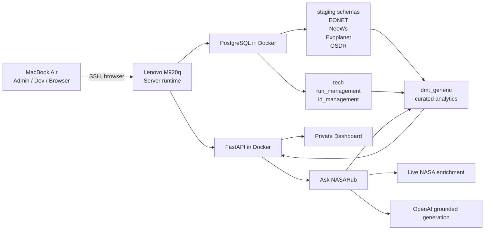

# NASAHub Project Documentation

NASAHub is a private, self-hosted NASA data platform running on a Lenovo M920q.

Its purpose is to ingest raw scientific data, track lineage and operational status, curate analytics-ready datasets, expose them through FastAPI, and provide a private dashboard for admin use from the MacBook.

## 1. Deployment Model

### Lenovo M920q

The Lenovo is the actual server and runtime environment.

It hosts:

* Ubuntu Server 24.04
* Docker and Docker Compose
* PostgreSQL
* FastAPI
* Alembic migrations
* cron-triggered ingestion jobs
* the full project codebase
* all persisted project data

### MacBook Air

The MacBook is the admin and development machine.

It is used to:

* SSH into the Lenovo
* use VS Code Remote SSH for development
* inspect PostgreSQL over an SSH tunnel
* browse the private dashboard and API from a normal workstation

Important principle:

* code and data live on the Lenovo
* coding and viewing happen from the MacBook
* the MacBook is not the runtime host

## 2. Platform Objective

NASAHub is evolving into a GenAI-ready analytics platform with this flow:

1. ingest raw source data into staging
2. track ingestion runs and lineage centrally
3. transform raw data into curated analytics views
4. expose curated datasets through a stable API
5. later support dashboards, apps, and chat/agent features

This means NASAHub is no longer just an ingestion project. It is becoming a layered analytics platform.

## 2A. Architecture Schema

### Visual Diagram


### Logical Diagram



### Process Flow

1. Wrapper scripts under `scripts/` trigger ingestion jobs on the Lenovo.
2. Source ingestors load raw data into staging schemas.
3. Technical metadata is recorded in `tech.run_management` and `tech.id_management`.
4. Curated analytics views in `dmt_generic` reshape source data into stable analytical datasets.
5. FastAPI exposes those curated datasets through analytics, detail, and retrieval routes.
6. The private dashboard consumes the API for overview, exploration, and guided retrieval.
7. Ask NASAHub uses retrieval-first logic in two modes:
   * entity mode for known objects, events, or planets
   * general mode for broad questions across the curated platform
8. Optional live enrichment and OpenAI-backed grounded answers sit on top of the curated layer, not below it.

## 3. Repository Structure

Key directories:

* `api/` -> FastAPI app, routers, response models
* `core/` -> shared configuration
* `db/` -> DB session/dependencies and Alembic migrations
* `docs/` -> project documentation
* `frontend/` -> private dashboard assets
* `ingestors/` -> source-specific ingestion modules
* `infra/` -> Docker Compose and environment configuration
* `scripts/` -> cron wrapper scripts
* `tests/` -> analytics and API tests

Important implementation files:

* `api/main.py`
* `api/routes/analytics.py`
* `api/schemas.py`
* `core/config.py`
* `tests/test_analytics_routes.py`

## 3A. Backup And Restore Operations

NASAHub now includes a first operational backup layer for PostgreSQL.

### Backup

Script:

* [`run_postgres_backup.sh`](/home/hl-lenovo/projects/nasahub/scripts/run_postgres_backup.sh)

Behavior:

* loads configuration from [`infra/.env`](/home/hl-lenovo/projects/nasahub/infra/.env)
* performs a `pg_dump --format=custom` from the `nasahub-postgres` container
* writes dumps into a timestamped directory
* writes `metadata.json` beside the dump
* prunes old backup directories using retention days

Default location:

* `/home/hl-lenovo/projects/nasahub/backups/postgres`

### Restore

Script:

* [`restore_postgres_backup.sh`](/home/hl-lenovo/projects/nasahub/scripts/restore_postgres_backup.sh)

Behavior:

* requires an explicit backup path
* prompts for a typed confirmation before continuing
* restores through `pg_restore --clean --if-exists`

### Backup Configuration

Expected environment variables:

* `BACKUP_ROOT`
* `BACKUP_RETENTION_DAYS`

Template values are documented in [`infra/.env.example`](/home/hl-lenovo/projects/nasahub/infra/.env.example).

### Recommended Next Operational Step

The current implementation is a good first safety layer, but the platform should next add:

* scheduled cron execution on the Lenovo
* off-device backup copies
* a tested restore drill

## 3B. Monitoring And Alerting Operations

NASAHub now includes a first operational monitoring script for the public Lenovo-hosted deployment.

### Monitoring Script

Script:

* [`check_nasahub_health.sh`](/home/hl-lenovo/projects/nasahub/scripts/check_nasahub_health.sh)

Behavior:

* verifies the main Docker containers are running
* checks local API readiness
* checks public domain readiness
* verifies PostgreSQL backup freshness
* verifies latest per-endpoint ingestion status and freshness from `tech.run_management`
* checks certificate lifetime for the public host
* optionally posts a JSON alert payload to a configured webhook
* writes the latest monitor snapshot to `MONITOR_STATUS_FILE` for dashboard/API consumption

The script groups monitoring output into five categories:

* platform health
* public availability
* backup safety
* ingestion freshness
* certificate status

### Monitoring Configuration

Supported environment variables:

* `MONITOR_PUBLIC_BASE_URL`
* `MONITOR_LOCAL_READY_URL`
* `MONITOR_PUBLIC_READY_URL`
* `MONITOR_TIMEOUT_SECONDS`
* `MONITOR_BACKUP_MAX_AGE_HOURS`
* `MONITOR_CERT_MIN_DAYS`
* `MONITOR_RUN_MAX_AGE_HOURS`
* source-aware run freshness overrides such as:
  * `MONITOR_RUN_MAX_AGE_HOURS_EONET_EVENTS`
  * `MONITOR_RUN_MAX_AGE_HOURS_NEOWS_NEO_FEED`
  * `MONITOR_RUN_MAX_AGE_HOURS_EXOPLANET_PSCOMPPARS`
  * `MONITOR_RUN_MAX_AGE_HOURS_OSDR_FILES`
* `MONITOR_ALERT_WEBHOOK_URL`

Template values are documented in [`infra/.env.example`](/home/hl-lenovo/projects/nasahub/infra/.env.example).

Run freshness is intentionally source-aware:

* fast operational feeds such as EONET and `neows/neo_feed` use tighter thresholds
* broader catalog/reference loads such as `neo_browse`, `neo_lookup`, `exoplanet/ps`, and slower OSDR entities use looser thresholds
* `MONITOR_RUN_MAX_AGE_HOURS` remains the fallback for any endpoint that does not have an explicit override

### Operational Use

Recommended baseline:

* scheduled backup job once per day
* scheduled monitoring check every 15 minutes
* public readiness check through `nasahub.cloud`
* webhook alerting if a simple notification endpoint is available

### Managed Cron Wiring

NASAHub now includes a managed cron template and installer:

* [`nasahub.crontab`](/home/hl-lenovo/projects/nasahub/infra/nasahub.crontab)
* [`install_nasahub_cron.sh`](/home/hl-lenovo/projects/nasahub/scripts/install_nasahub_cron.sh)

This installer:

* keeps unrelated user crontab entries intact
* replaces only the NASAHub-managed block
* installs the current operational baseline:
  * daily PostgreSQL backup
  * 15-minute monitoring checks

## 4. Database Architecture

### Schemas

The active database design uses:

* `tech`
* `stg_eonet`
* `stg_neows`
* `stg_exoplanet`
* `stg_osdr`
* `dmt_generic`

### Technical Metadata Layer

#### `tech.run_management`

Purpose:

* one row per ingestion execution
* operational run status and timing

Typical fields:

* `source_name`
* `source_endpoint`
* `status`
* `run_started_at`
* `run_finished_at`
* `records_inserted`

#### `tech.id_management`

Purpose:

* one row per inserted staging record
* lineage between source record, staging row, and run

### Staging Layer

All staging tables follow the project technical metadata convention:

* `id`
* `s_ingested_at`
* `s_source_url`
* `s_run_id`
* `s_payload`

Design principles:

* raw staging first
* keep source payloads close to origin
* use business-key deduplication
* defer business logic to curated views

## 5. Current Source Coverage

### EONET

Loaded into `stg_eonet`:

* `events`
* `categories`
* `sources`
* `layers`

### NeoWs

Loaded into `stg_neows`:

* `neo_feed`
* `neo_browse`
* `neo_lookup`

Operational emphasis:

* `neo_feed` is the recurring operational load
* `neo_browse` is the broader catalog/reference load

### Exoplanet Archive

Loaded into `stg_exoplanet`:

* `ps`
* `pscomppars`

Operational emphasis:

* `pscomppars` is the main scheduled table
* `ps` is a lower-frequency reference refresh

### OSDR

Loaded into `stg_osdr`:

* `datasets`
* `assays`
* `samples`
* `files`

## 6. Curated Analytics Layer

The curated analytics layer lives in `dmt_generic`.

This is the layer intended for:

* API consumers
* dashboards
* future GenAI or agent use

It exists so consumers do not need to work directly with raw staging tables or source-shaped JSON fields.

### Current Curated Views

#### Platform / operations

* `v_dmt_ingestion_status`

#### NeoWs

* `v_dmt_neows_daily_summary`
* `v_dmt_neows_kpis`

#### EONET

* `v_dmt_eonet_category_summary`
* `v_dmt_eonet_event_overview`

#### Exoplanet

* `v_dmt_exoplanet_discovery_yearly_summary`
* `v_dmt_exoplanet_discovery_method_summary`
* `v_dmt_exoplanet_catalog`

#### OSDR

* `v_dmt_osdr_dataset_summary`
* `v_dmt_osdr_assay_type_summary`
* `v_dmt_osdr_dataset_catalog`

### Alembic Migrations Added For Analytics

* `854e4dbf9562_add_dmt_generic_views.py`
* `c4d5e6f7a8b9_add_eonet_analytics_views.py`
* `d1e2f3a4b5c6_add_exoplanet_analytics_views.py`
* `e7f8a9b0c1d2_add_osdr_analytics_views.py`

## 7. FastAPI Layer

FastAPI is the controlled access layer over curated data.

Implementation style currently used:

* function-based routes
* `Depends(get_db)` for DB access
* a dedicated analytics router in `api/routes/analytics.py`
* typed response models in `api/schemas.py`

### Platform Endpoints

* `GET /health/live`
* `GET /health/ready`
* `GET /health`
* `GET /ingestion-runs`
* `GET /analytics/catalog`

### Analytics Endpoints

#### Ingestion

* `GET /analytics/ingestion-status`

#### NeoWs

* `GET /analytics/neows/daily-summary`
* `GET /analytics/neows/kpis`
* `GET /analytics/neows/objects`
* `GET /analytics/neows/object/{neo_reference_id}`
* `GET /analytics/neows/object/{neo_reference_id}/approaches`
* `GET /analytics/neows/object/{neo_reference_id}/insight`
* `GET /analytics/neows/object/{neo_reference_id}/live-enrichment`

#### EONET

* `GET /analytics/eonet/category-summary`
* `GET /analytics/eonet/event-overview`
* `GET /analytics/eonet/event/{event_id}`
* `GET /analytics/eonet/event/{event_id}/insight`

Filter/pagination parameters:

* `limit`
* `offset`
* `category_id`
* `event_status`

#### Exoplanet

* `GET /analytics/exoplanet/discovery-yearly-summary`
* `GET /analytics/exoplanet/discovery-method-summary`
* `GET /analytics/exoplanet/catalog`
* `GET /analytics/exoplanet/planets`
* `GET /analytics/exoplanet/planet/{pl_name}`
* `GET /analytics/exoplanet/planet/{pl_name}/insight`

Filter/pagination parameters:

* `limit`
* `offset`
* `discovery_method`
* `disc_year`

#### OSDR

* `GET /analytics/osdr/dataset-summary`
* `GET /analytics/osdr/assay-type-summary`
* `GET /analytics/osdr/datasets`

#### Retrieval / agent

* `POST /analytics/ask`

Filter/pagination parameters:

* `limit`
* `offset`
* `data_source`
* `dataset_accession`

### API Contract Features

Implemented:

* typed response models
* OpenAPI registration
* consistent paginated response wrappers
* analytics endpoint discovery through `/analytics/catalog`
* request IDs in responses
* structured access logging

## 8. Health, Auth, And Logging

### Health

The API now distinguishes:

* liveness -> process is up
* readiness -> API can reach PostgreSQL

Routes:

* `/health/live`
* `/health/ready`
* `/health`

### Optional Private Auth

Auth is available but can remain disabled for private LAN-only usage.

Config flags:

* `API_REQUIRE_AUTH`
* `API_AUTH_TOKEN`

Supported auth headers:

* `X-API-Key`
* `Authorization: Bearer <token>`

### Request Tracing

Implemented in `api/main.py`:

* inbound `X-Request-ID` reuse if present
* generated request ID otherwise
* `X-Request-ID` returned on responses
* structured access log payload written to stdout

Captured fields include:

* `request_id`
* `method`
* `path`
* `status_code`
* `duration_ms`

## 9. Private Dashboard

NASAHub now includes a private dashboard served directly by FastAPI.

Routes:

* `GET /dashboard`
* `GET /` -> redirect to `/dashboard`
* `/dashboard-assets/*` for static assets

Implementation approach:

* static `index.html`
* static `dashboard.css`
* static `dashboard.js`
* no Node or frontend build pipeline

This choice was intentional to keep the private admin UI lightweight and easy to operate on the Lenovo.

### Dashboard Purpose

The dashboard is the first consumer of the analytics API.

It gives the admin a browser-based view of:

* system overview
* ingestion posture
* NeoWs signals
* EONET activity
* Exoplanet discovery summaries
* OSDR dataset/assay summaries
* filtered explorer previews for paginated endpoints

### Dashboard Resilience Improvement

The dashboard originally loaded all sections through one shared fetch batch, which caused one failed endpoint to make the full page look broken.

That has been improved so sections now load independently. A single source failure no longer blanks the entire dashboard.

### Ask NASAHub

The dashboard now includes a top-level Ask NASAHub panel with:

* `entity` mode for exact record questions
* `general` mode for broad questions without a required entity ID
* browser-side conversation memory
* grounded citations
* ranked matched entities
* optional live NeoWs enrichment

Current general retrieval intent coverage:

* NeoWs: biggest, fastest, closest, hazardous
* EONET: latest, open, category-focused
* Exoplanet: nearest, largest, newest, discovery-method focused

## 10. Monitoring Model

NASAHub no longer uses file-based ingestion logging as the primary monitoring mechanism.

Monitoring now relies on:

* `tech.run_management`
* `tech.id_management`
* curated ingestion status views
* API health/readiness endpoints
* structured container logs

This is an intentional shift away from flat log files and toward PostgreSQL-backed operational visibility.

## 11. Testing

Current analytics/API coverage lives in:

* `tests/test_analytics_routes.py`

The test suite covers:

* analytics route registration
* response model wiring
* health behavior
* auth helper behavior
* analytics catalog behavior
* pagination contract shape
* request ID and access-log helpers
* dashboard file existence
* view-backed query functions

Run with:

```bash
./.venv/bin/python -m unittest tests.test_analytics_routes
```

## 12. Current Operational Summary

As of this documentation update, NASAHub now has:

* raw ingestion across EONET, NeoWs, Exoplanet, and OSDR
* centralized run and lineage tracking
* curated analytics views in `dmt_generic`
* a typed FastAPI analytics layer
* pagination and filtering on large analytics endpoints
* analytics endpoint discovery
* optional API auth
* request tracing and structured access logs
* a private dashboard served from the same API service
* Ask NASAHub with retrieval-first chat behavior
* entity and general question modes
* intent-aware ranking for broad questions

## 13. Recommended Next Steps

Documentation is now aligned with the implemented system.

Natural next steps after this point:

* improve dashboard UX and source-level navigation
* add more curated analytics where needed
* tighten auth if exposure widens
* prepare the curated API layer for future chat/agent features
